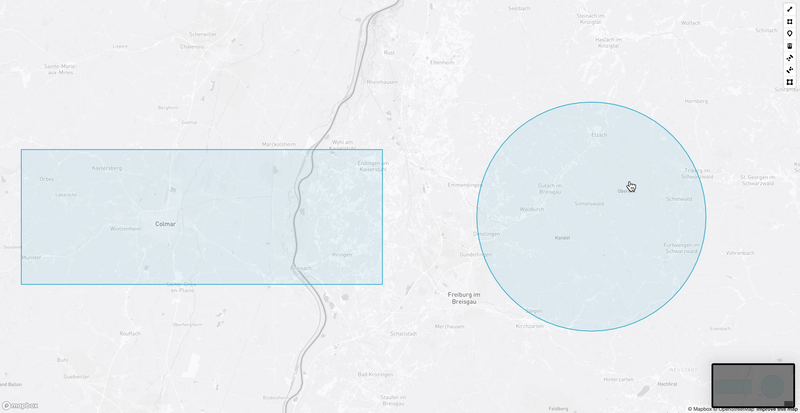

[](https://www.npmjs.com/package/mapbox-split-polygon-mode)
[](https://github.com/marcosci/mapbox-split-polygon-mode/actions/workflows/develop.yml)
[](https://github.com/marcosci/mapbox-split-polygon-mode/actions/workflows/release.yml)

# mapbox-split-polygon-mode

A revised and modified version of the custom mode for [MapboxGL-Draw](https://github.com/mapbox/mapbox-gl-draw) to split polygons based on a drawn lineString from [Reyhane Masumi](https://github.com/ReyhaneMasumi/mapbox-gl-draw-split-polygon-mode/blob/main/.github/workflows/develop.yml).

## [DEMO](https://marcosci.github.io/mapbox-split-polygon-mode/)



## Install

```bash
npm install mapbox-split-polygon-mode
```

or use CDN:

```html
<script src="https://unpkg.com/mapbox-split-polygon-mode"></script>
```

## Usage

```js
import mapboxGl from "mapbox-gl";
import MapboxDraw from "@mapbox/mapbox-gl-draw";
import defaultDrawStyle from "@mapbox/mapbox-gl-draw/src/lib/theme.js";

import SplitPolygonMode, {
  drawStyles as splitPolygonDrawStyles,
} from "mapbox-split-polygon-mode";

const map = new mapboxgl.Map({
  container: "map",
  center: [-91.874, 42.76],
  zoom: 12,
});

draw = new MapboxDraw({
  userProperties: true,
  displayControlsDefault: false,
  modes: {
    ...SplitPolygonMode(MapboxDraw.modes),
  },
  styles: [...splitPolygonDrawStyles(defaultDrawStyle)],
  userProperties: true,
});

map.addControl(draw);

/// Activate the mode
draw.changeMode("split_polygon");

/// you can modify the behavior using these options:
draw.changeMode(
  "split_polygon",
  /** Default option values: */
  {
    highlightColor: "#222",
    lineWidth: 0,
    lineWidthUnit: "kilometers",
  }
);
```

## License

MIT © [marcosci](LICENSE)
